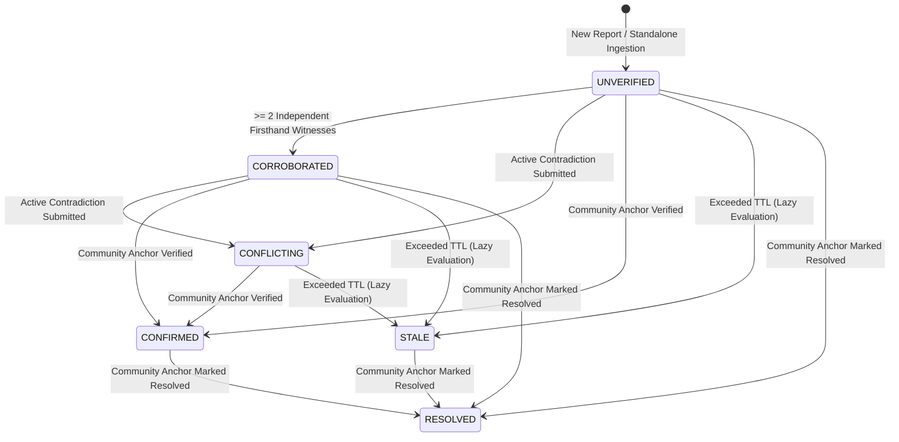

# SignalNG Backend API Consumption Guide

SignalNG is a mobile-first, hyper-local crisis triage engine. It organizes uncertain community observations without claiming that automated heuristics or AI can establish ground truth or declare locations safe.

---

## 1. Base URL & Environment Configuration

| Environment | Base URL |
| :--- | :--- |
| **Development** | `http://localhost:3000` |
| **Production** | Configured via `PORT` and reverse proxy (e.g. `https://api.signalng.org`) |

All API endpoints are prefixed with `/api`.

---

## 2. Authentication Flow & Cookie/Token Management

SignalNG supports **HTTP-only Cookie** session authentication (recommended for web applications to mitigate XSS attacks) as well as traditional **Bearer Token** authentication via JSON Web Tokens (JWT) for mobile or programmatic API consumers.

### Registration: `POST /api/auth/register`
**Public**

```bash
curl -X POST http://localhost:3000/api/auth/register \
  -H "Content-Type: application/json" \
  -d '{
    "name": "Jane Doe",
    "email": "jane.doe@example.com",
    "phone": "+2348012345678",
    "password": "SecurePassword123!"
  }'
```

**Response Headers:**
```http
Set-Cookie: token=eyJhbGciOiJIUzI1NiIsInR5cCI6IkpXVCJ9...; Path=/; HttpOnly; SameSite=Strict
```

**Response Body (201 Created):**
```json
{
  "success": true,
  "statusCode": 201,
  "message": "Registration successful",
  "data": {
    "token": "eyJhbGciOiJIUzI1NiIsInR5cCI6IkpXVCJ9...",
    "user": {
      "id": "usr_9c80d453-2bd1-4cfa-8182-01a238618e47",
      "name": "Jane Doe",
      "email": "jane.doe@example.com",
      "phone": "+2348012345678",
      "role": "RESIDENT",
      "status": "ACTIVE",
      "createdAt": "2026-09-25T18:00:00.000Z",
      "lastLoginAt": null
    }
  }
}
```

### Login: `POST /api/auth/login`
**Public**

```bash
curl -X POST http://localhost:3000/api/auth/login \
  -H "Content-Type: application/json" \
  -d '{
    "email": "jane.doe@example.com",
    "password": "SecurePassword123!"
  }'
```

**Response Headers:**
```http
Set-Cookie: token=eyJhbGciOiJIUzI1NiIsInR5cCI6IkpXVCJ9...; Path=/; HttpOnly; SameSite=Strict
```

**Response Body (200 OK):**
```json
{
  "success": true,
  "statusCode": 200,
  "message": "Login successful",
  "data": {
    "token": "eyJhbGciOiJIUzI1NiIsInR5cCI6IkpXVCJ9...",
    "user": {
      "id": "usr_9c80d453-2bd1-4cfa-8182-01a238618e47",
      "name": "Jane Doe",
      "email": "jane.doe@example.com",
      "phone": "+2348012345678",
      "role": "RESIDENT",
      "status": "ACTIVE",
      "createdAt": "2026-09-25T18:00:00.000Z",
      "lastLoginAt": "2026-09-25T18:05:00.000Z"
    }
  }
}
```

### Logout: `POST /api/auth/logout`
**Authenticated**

Clears the `token` cookie and invalidates client session.

### Authentication Strategy & Header Support

The server automatically extracts the authentication token using the following precedence:
1. **HTTP-only Cookie**: Checks `req.cookies.token`.
2. **Authorization Header**: Fallback to `Authorization: Bearer <your_jwt_access_token>`.

```http
Authorization: Bearer <your_jwt_access_token>
```

### Client Implementation Recommendations
- **Web Applications**: Rely on automatic browser cookie transmission with `credentials: 'include'` / `withCredentials: true`. The `HttpOnly` and `SameSite=Strict` flags provide built-in defense against XSS and CSRF.
- **Mobile / Programmatic Clients**: Extract the `token` field from the response JSON payload and pass it in the `Authorization: Bearer` header on subsequent requests.

---

## 3. Public vs Authenticated Endpoints Matrix

| Endpoint | Method | Access | Description |
| :--- | :--- | :--- | :--- |
| `GET /` | `GET` | Public | Baseplate ping check |
| `GET /health` | `GET` | Public | Comprehensive health check (database, uptime, AI provider) |
| `GET /api/health` | `GET` | Public | Comprehensive health check (database, uptime, AI provider) |
| `POST /api/auth/register` | `POST` | Public | Register new resident/user |
| `POST /api/auth/login` | `POST` | Public | Authenticate user |
| `POST /api/auth/logout` | `POST` | Authenticated | Logout session |
| `GET /api/auth/me` | `GET` | Authenticated | Get current authenticated user profile |
| `GET /api/users/me` | `GET` | Authenticated | User profile inspection |
| `PATCH /api/users/me` | `PATCH` | Authenticated | Update name/email/phone (cannot change own role) |
| `GET /api/incidents/nearby` | `GET` | Public | Discover active incidents within radius |
| `GET /api/incidents/:id` | `GET` | Public | Fetch incident details with coordinate masking |
| `GET /api/incidents/:id/timeline` | `GET` | Public | Fetch chronological incident audit timeline |
| `POST /api/reports` | `POST` | Authenticated | Submit standalone report with auto-linking |
| `POST /api/incidents/:id/reports` | `POST` | Authenticated | Submit report attached to specific incident |
| `GET /api/incidents/:id/reports` | `GET` | Public | Retrieve audited reports for an incident |
| `GET /api/reports/:id` | `GET` | Public | Retrieve report by ID |
| `POST /api/incidents/:id/attestations` | `POST` | Authenticated | Submit community attestation |
| `GET /api/incidents/:id/attestations` | `GET` | Public | Retrieve attestations for an incident |
| `POST /api/incidents/:id/confirm` | `POST` | `COMMUNITY_ANCHOR` / `ADMIN` | Anchor-verify an incident |
| `POST /api/incidents/:id/resolve` | `POST` | `COMMUNITY_ANCHOR` / `ADMIN` | Mark incident resolved |
| `POST /api/incidents/:id/recalculate` | `POST` | Authenticated | Recalculate deterministic incident state |
| `GET /api/admin/users` | `GET` | `MODERATOR` / `ADMIN` | Paginated user management list |
| `PATCH /api/admin/users/:id/role` | `PATCH` | `ADMIN` | Elevate or alter user roles |
| `PATCH /api/admin/users/:id/status` | `PATCH` | `MODERATOR` / `ADMIN` | Suspend or reactivate accounts |
| `GET /api/admin/reports/quarantined` | `GET` | `MODERATOR` / `ADMIN` | Review panic or vague quarantined reports |
| `POST /api/admin/reports/:id/approve` | `POST` | `MODERATOR` / `ADMIN` | Approve quarantined report |
| `POST /api/admin/reports/:id/reject` | `POST` | `MODERATOR` / `ADMIN` | Reject malicious or spam report |
| `GET /api/admin/audit-logs` | `GET` | `MODERATOR` / `ADMIN` | Inspect tamper-evident audit logs |
| `GET /api/admin/settings` | `GET` | `MODERATOR` / `ADMIN` | Retrieve system TTL and radius settings |
| `PATCH /api/admin/settings` | `PATCH` | `ADMIN` | Update system configuration |

---

## 4. Domain Concepts & State Machine

### 4.1 Incident States



- **`UNVERIFIED`**: Initial state of any new report or uncorroborated single-source sighting.
- **`CORROBORATED`**: At least two distinct, independent firsthand witnesses reported or attested within the proximity window. Duplicate forwards and hearsay do not count.
- **`CONFLICTING`**: Community members submitted direct on-scene contradictions (`ACTIVE_CONTRADICTION`).
- **`CONFIRMED`**: Officially verified by an authorized `COMMUNITY_ANCHOR` or Administrator.
- **`STALE`**: No recent reaffirming reports received before the configurable TTL expired (default 60 minutes).
- **`RESOLVED`**: Incident has ended and marked resolved by a Community Anchor.

### 4.2 Attestation Types

- **`FIRSTHAND_WITNESS`**: Submitter is physically at the location and confirms the observation firsthand. Requires coordinates where available.
- **`ACTIVE_CONTRADICTION`**: Submitter is physically present and observes that the reported condition does not exist (e.g. "Road is completely clear"). Requires a descriptive comment.
- **`HEARSAY_TRACKING`**: Observation received via social media or messaging forwards. Tracked for chatter volume but does not count toward independent corroboration.

---

## 5. Privacy & Coordinate Masking Rules

To protect reporter safety and prevent targeted harassment:
1. **Public Read Serialization**: Coordinates returned from public endpoints (`GET /api/incidents/nearby`, `GET /api/incidents/:id`, `GET /api/reports/:id`) are masked to **2 decimal places** (~1.1 km accuracy) or omitted in favor of `locationLabel`.
2. **Reporter Anonymity**: Submitter user IDs, names, and contact details are stripped from all public endpoints.
3. **Privileged Roles**: Only authenticated `MODERATOR` and `ADMIN` users receive full-precision coordinates and audit metadata.

---

## 6. Standalone Report Intake & Proximity Auto-Linking

When submitting via `POST /api/reports`:
1. The backend searches for active (non-stale, non-resolved) incidents within **1.5 km** created in the last **45 minutes**.
2. If a compatible incident is found, the report links to it automatically:
   `"linkage": { "type": "LINKED_TO_EXISTING_INCIDENT", "distanceKm": 0.42, "incidentId": "inc_..." }`
3. If no active incident matches, a new incident is created in the `UNVERIFIED` state:
   `"linkage": { "type": "USED_TO_CREATE_INCIDENT", "incidentId": "inc_..." }`
4. The AI triage engine (powered by `openai/gpt-oss-120b` via Groq) automatically audits completeness and flags panic wording or duplicate clusters. If panic or missing details exceed threshold, `triageStatus` is marked `QUARANTINED`.
5. AI outputs strictly conform to predefined JSON schemas with deterministic offline mock fallback if external connectivity is lost. The AI is purely advisory and never declares ground truth or declares locations safe.

---

## 7. Frontend Workflow Walkthroughs

### Workflow 1: Fetch Nearby Incidents (Public)

```bash
curl -X GET "http://localhost:3000/api/incidents/nearby?lat=9.0765&lng=7.3986&radiusKm=5"
```

**Response (200 OK):**
```json
{
  "success": true,
  "statusCode": 200,
  "message": "Nearby incidents retrieved",
  "data": [
    {
      "id": "inc_corroborated_flood_01",
      "title": "Flooding on Bridge Culvert",
      "incidentType": "FLOODING",
      "state": "CORROBORATED",
      "latitude": 9.08,
      "longitude": 7.48,
      "locationLabel": "Wuse II Bridge Culvert",
      "summary": "Two independent firsthand witnesses report water rising over the culvert deck.",
      "confidenceLevel": "MEDIUM",
      "distanceKm": 0.84,
      "expiresAt": "2026-09-25T19:00:00.000Z",
      "createdAt": "2026-09-25T18:00:00.000Z",
      "updatedAt": "2026-09-25T18:05:00.000Z"
    }
  ]
}
```

---

### Workflow 2: Submit a Standalone Report (Authenticated)

```bash
curl -X POST http://localhost:3000/api/reports \
  -H "Authorization: Bearer <JWT_TOKEN>" \
  -H "Content-Type: application/json" \
  -d '{
    "rawText": "Sparking transformer wire fell across the road near market entrance 2.",
    "incidentType": "INFRASTRUCTURE",
    "sourceType": "FIRSTHAND",
    "locationLabel": "Maitama Market Gate 2",
    "latitude": 9.0765,
    "longitude": 7.3986,
    "eventTime": "2026-09-25T18:15:00.000Z"
  }'
```

**Response (201 Created):**
```json
{
  "success": true,
  "statusCode": 201,
  "message": "Report submitted successfully",
  "data": {
    "report": {
      "id": "rep_28d9c104-e65b-4228-868c-ff59f40076a1",
      "incidentId": "inc_51480f2d-4537-4bf3-a3d2-a5d625bc20c9",
      "rawText": "Sparking transformer wire fell across the road near market entrance 2.",
      "incidentType": "INFRASTRUCTURE",
      "sourceType": "FIRSTHAND",
      "inputType": "TEXT",
      "latitude": 9.08,
      "longitude": 7.4,
      "locationLabel": "Maitama Market Gate 2",
      "eventTime": "2026-09-25T18:15:00.000Z",
      "triageStatus": "AUDITED",
      "extractedDetails": {
        "incidentType": "INFRASTRUCTURE",
        "landmark": "Maitama Market Gate 2",
        "approximateTime": "2026-09-25T18:15:00.000Z",
        "severityKeywords": []
      },
      "missingDetails": [],
      "createdAt": "2026-09-25T18:16:00.000Z"
    },
    "incident": {
      "id": "inc_51480f2d-4537-4bf3-a3d2-a5d625bc20c9",
      "title": "INFRASTRUCTURE near Maitama Market Gate 2",
      "incidentType": "INFRASTRUCTURE",
      "state": "UNVERIFIED",
      "latitude": 9.08,
      "longitude": 7.4,
      "locationLabel": "Maitama Market Gate 2",
      "confidenceLevel": "LOW",
      "expiresAt": "2026-09-25T19:16:00.000Z",
      "createdAt": "2026-09-25T18:16:00.000Z",
      "updatedAt": "2026-09-25T18:16:00.000Z"
    },
    "linkage": {
      "type": "USED_TO_CREATE_INCIDENT",
      "incidentId": "inc_51480f2d-4537-4bf3-a3d2-a5d625bc20c9"
    }
  }
}
```

---

### Workflow 3: Submit a Firsthand Attestation

```bash
curl -X POST http://localhost:3000/api/incidents/inc_51480f2d-4537-4bf3-a3d2-a5d625bc20c9/attestations \
  -H "Authorization: Bearer <JWT_TOKEN>" \
  -H "Content-Type: application/json" \
  -d '{
    "action": "FIRSTHAND_WITNESS",
    "comment": "I am standing at Gate 2 right now, fire service has just arrived to cordone off the wire.",
    "latitude": 9.0766,
    "longitude": 7.3987,
    "locationLabel": "Gate 2 Entrance"
  }'
```

**Response (201 Created):**
```json
{
  "success": true,
  "statusCode": 201,
  "message": "Attestation recorded successfully",
  "data": {
    "attestation": {
      "id": "att_f284b47a-c7da-4e0f-90e6-8d51965e6e8e",
      "incidentId": "inc_51480f2d-4537-4bf3-a3d2-a5d625bc20c9",
      "action": "FIRSTHAND_WITNESS",
      "comment": "I am standing at Gate 2 right now, fire service has just arrived to cordone off the wire.",
      "latitude": 9.08,
      "longitude": 7.4,
      "locationLabel": "Gate 2 Entrance",
      "createdAt": "2026-09-25T18:18:00.000Z"
    },
    "incident": {
      "id": "inc_51480f2d-4537-4bf3-a3d2-a5d625bc20c9",
      "state": "CORROBORATED"
    },
    "transition": {
      "previousState": "UNVERIFIED",
      "nextState": "CORROBORATED",
      "reason": "2 independent firsthand witnesses corroborated the incident",
      "shouldNotify": true
    }
  }
}
```

---

### Workflow 4: Submit an Active Contradiction

```bash
curl -X POST http://localhost:3000/api/incidents/inc_51480f2d-4537-4bf3-a3d2-a5d625bc20c9/attestations \
  -H "Authorization: Bearer <JWT_TOKEN>" \
  -H "Content-Type: application/json" \
  -d '{
    "action": "ACTIVE_CONTRADICTION",
    "comment": "The cable was fully repaired by the power utility crew and power restored. Road is clear."
  }'
```

**Response (201 Created):**
```json
{
  "success": true,
  "statusCode": 201,
  "message": "Attestation recorded successfully",
  "data": {
    "attestation": {
      "id": "att_a1b2c3d4-e5f6-7890-1234-56789abcdef0",
      "incidentId": "inc_51480f2d-4537-4bf3-a3d2-a5d625bc20c9",
      "action": "ACTIVE_CONTRADICTION",
      "comment": "The cable was fully repaired by the power utility crew and power restored. Road is clear.",
      "createdAt": "2026-09-25T18:25:00.000Z"
    },
    "incident": {
      "id": "inc_51480f2d-4537-4bf3-a3d2-a5d625bc20c9",
      "state": "CONFLICTING"
    },
    "transition": {
      "previousState": "CORROBORATED",
      "nextState": "CONFLICTING",
      "reason": "Active contradiction submitted by community members",
      "shouldNotify": false
    }
  }
}
```

---

### Workflow 5: Anchor Confirmation & Resolution

Only users with role `COMMUNITY_ANCHOR` or `ADMIN` can execute confirmation and resolution.

#### Confirm Incident: `POST /api/incidents/:id/confirm`
```bash
curl -X POST http://localhost:3000/api/incidents/inc_51480f2d-4537-4bf3-a3d2-a5d625bc20c9/confirm \
  -H "Authorization: Bearer <ANCHOR_JWT_TOKEN>"
```

#### Resolve Incident: `POST /api/incidents/:id/resolve`
```bash
curl -X POST http://localhost:3000/api/incidents/inc_51480f2d-4537-4bf3-a3d2-a5d625bc20c9/resolve \
  -H "Authorization: Bearer <ANCHOR_JWT_TOKEN>"
```

---

## 8. HTTP Status Codes & Error Response Format

All error responses adhere to the standard JSON structure:
```json
{
  "success": false,
  "statusCode": 422,
  "message": "Validation failed",
  "errors": [
    {
      "field": "body.locationLabel",
      "message": "Location label must be at least 3 characters"
    }
  ]
}
```

### Standard Status Codes:
- `200 OK`: Request succeeded.
- `201 Created`: Resource successfully created.
- `400 Bad Request`: Malformed parameters or invalid coordinates.
- `401 Unauthorized`: Missing or invalid Bearer access token.
- `403 Forbidden`: Insufficient role permissions or account is `SUSPENDED`.
- `404 Not Found`: Resource does not exist.
- `409 Conflict`: Resource conflict (e.g. duplicate email or duplicate attestation submitted within cooldown).
- `422 Unprocessable Entity`: Request body or query failed schema validation.
- `429 Too Many Requests`: Rate limit threshold exceeded.
- `500 Internal Server Error`: Unhandled exception (logged internally, sanitised output returned).
